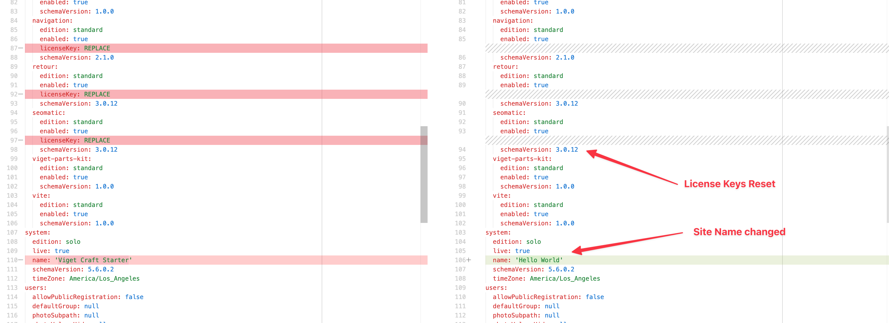
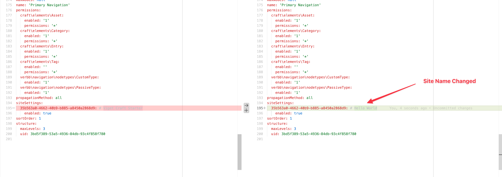

# Viget's Craft CMS Starter

Our Craft Site Starter is a quick way to spin up a new Craft CMS project. It's pre-configured with top-notch build tooling, common plugins and starter components based on [Blueprint](https://github.com/vigetlabs/blueprint).

If you're a designer or developer at Viget working on a new project, view our [Building with Craft Site Starter](docs/building-with-site-starter.md) guide for more information.

# Features

- Local development [powered by DDEV](https://ddev.com/)
- [Vite](https://vitejs.dev/) based front-end build tooling.
- Automatic linting, formatting and typechecking
  - Runs on git pre-commit hook with [Husky](https://typicode.github.io/husky/)
  - Only processes staged files using [lint-staged](https://github.com/lint-staged/lint-staged)
  - [Prettier](https://prettier.io/), [eslint](https://eslint.org/), [PHPStan](https://github.com/craftcms/phpstan), [PHP
    Easy Coding Standard](https://github.com/craftcms/ecs)
- Common plugins come pre-installed
- Local email is routed
  through [Mailpit](https://ddev.readthedocs.io/en/stable/users/usage/developer-tools/#email-capture-and-review-mailpit) (
  never worry about emailing a client or user)
- Starter components based on [Blueprint](https://github.com/vigetlabs/blueprint)
- A fully accessible header and navigation
- A simple Matrix Field based block editor

# Getting Started

## Create Project

1. [Install DDEV](https://ddev.readthedocs.io/en/stable/users/install/ddev-installation/)
2. Choose a folder for your project and move into it:
   ```shell
   cd /path/to/web/projects
   mkdir my-project
   cd my-project
   ```
3. Create The Project
   If you already have PHP and Composer running on your host machine (your computer, not Docker container or DDEV
   instance), you can run the following command

   ```shell
   composer create-project viget/craft-site-starter=^5.0.0 ./ --ignore-platform-reqs
   ```

   If you'd rather not set up PHP, you can create the project with a disposable Docker
   image ([Thanks nystudio107](https://nystudio107.com/blog/dock-life-using-docker-for-all-the-things)).

   ```shell
   docker run --rm -it -v "$PWD":/app -v ${COMPOSER_HOME:-$HOME/.composer}:/tmp composer create-project viget/craft-site-starter=^5.0.0 ./ --ignore-platform-reqs
   ```

4. Start DDEV & Install Craft
   ```shell
   ddev start
   ddev craft install
   ```
5. Run `ddev launch` to open the project in your browser

# Plugins

This starter includes common plugins that we use on most of our sites. This provides consistency and familiarity between
client projects. You may not need every plugin, but avoid
replacing standard plugins with similar alternatives (unless absolutely necessary).

| Name                                                              | Composer                          | Usage                                                                                                                                                                              | Year 1 Price | Renewal Price |
| ----------------------------------------------------------------- | --------------------------------- | ---------------------------------------------------------------------------------------------------------------------------------------------------------------------------------- | ------------ | ------------- |
| [Amazon S3](https://plugins.craftcms.com/aws-s3)                  | `craftcms/aws-s3`                 | This plugin integrates Craft CMS and Amazon S3 cloud storage service.                                                                                                              | Free         | Free          |
| [Autocomplete](https://github.com/nystudio107/craft-autocomplete) | `nystudio107/craft-autocomplete`  | Provides Twig template IDE autocomplete of Craft CMS & plugin variables. Requires the [PHPStorm Symfony Support Plugin](https://plugins.jetbrains.com/plugin/7219-symfony-support) | Free         | Free          |
| [CKEditor](https://plugins.craftcms.com/ckeditor)                 | `craftcms/ckeditor`               | Craft CMS’s official rich text plugin                                                                                                                                              | Free         | Free          |
| [Classnames](https://plugins.craftcms.com/classnames)             | `viget/craft-classnames`          | Conditionally join css class names together in Twig                                                                                                                                | Free         | Free          |
| [Empty Coalesce](https://plugins.craftcms.com/empty-coalesce)     | `nystudio107/craft-emptycoalesce` | Adds the `???` operator to Twig that will return the first thing that is defined, not null, and not empty.                                                                         | Free         | Free          |
| [Imager X](https://plugins.craftcms.com/imager-x)                 | `spacecatninja/imager-x`          | Image optimization and Imgix connector. Provides useful Twig shortcuts for generating transforms and placeholders.                                                                 | $99.00       | $59.00        |
| [Navigation](https://plugins.craftcms.com/navigation)             | `verbb/navigation`                | Simplifies management of complex navigation groups (main menus, footer menus, etc.)                                                                                                | $19.00       | $5.00         |
| [Retour](https://plugins.craftcms.com/retour)                     | `nystudio107/craft-retour`        | Provides a Craft admin UI to set up redirects. Will automatically create redirects when URLs of entries change.                                                                    | $59.00       | $29.00        |
| [SEOMatic](https://plugins.craftcms.com/seomatic)                 | `nystudio107/craft-seomatic`      | A turnkey SEO plugin that follows [modern SEO best practices](https://nystudio107.com/blog/modern-seo-snake-oil-vs-substance).                                                     | $99.00       | $49.00        |
| [Vite](https://plugins.craftcms.com/vite)                         | `nystudio107/craft-vite`          | Loads front-end files that are compiled by Vite.                                                                                                                                   | Free         | Free          |
| [Expanded Singles](https://plugins.craftcms.com/expanded-singles) | `verbb/expanded-singles`          | Change the entries index sidebar to list all singles, rather than grouping them under a 'Singles' menu item.                                                                       | Free         | Free          |

# Contribute to this starter

## Local Dev

Ideally, you should be able to clone this repo and make modifications to plugin & build tool configs with minimal fuss.

Run the following and make edits in a feature branch:

```shell
ddev start
ddev craft install
```

See [ARCHITECTURE.md](ARCHITECTURE.md) for details on technical goals & decisions.

## Release Testing

Before releasing, run the following tests.

### Verify project renaming scripts work

- From within the Craft Site Starter repo, run `ddev composer run-script post-create-project-cmd` and follow the prompts.
- Use your IDE's diff view to verify that files are renamed properly.

<details>
<summary>Show Example</summary>





</details>

### Run the composer create script to create a new project.

```shell
docker run --rm -it -v "$PWD":/app -v ${COMPOSER_HOME:-$HOME/.composer}:/tmp composer create-project viget/craft-site-starter=5.x-dev ./ --ignore-platform-reqs
```

- Follow the prompts to create a new local site.
- Install Craft and ensure home page and Craft admin load.
