# Building with Craft Site Starter

## Overview

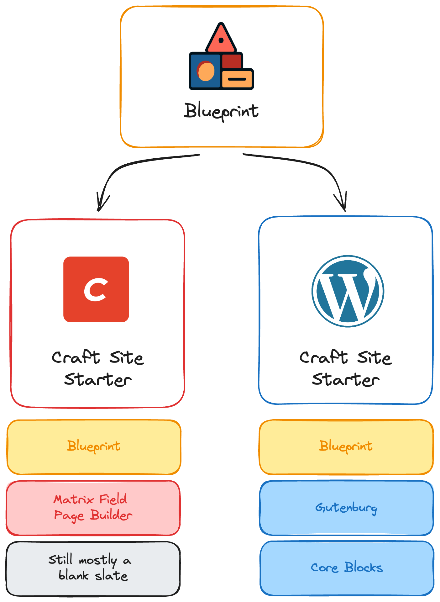

- Lives withing the broader ecosystem of Blueprint and WordPress Site Starter.
- Blueprint is the common design and naming system across both Site Starter projects.
- We aren't trying to have 100% parity with WordPress Site Starter.
- Craft Site Starter leans into the strengths of Craft CMS and the Craft ecosystem.
- Craft is more of a "blank slate" compared to WordPress.
- However, the starter contains Blueprint Components, a feature rich & fully accessible Header and Footer, and the beginnings of a simple Matrix Field based block editor.

## For Design & UX

### Blueprint

The Craft Site Starter's components library is based on Blueprint.

[🔗 Blueprint Github repo](https://github.com/vigetlabs/blueprint)

[🔗 Live Blueprint docs](https://staging.blueprint.viget.com/)

- A component library that serves as a guide for both design and development.
- It's meant to be customized, modified and adapted for projects.
- Just because a component exists in Blueprint doesn't mean it's the only way to do something. However, there is added cost the further we venture outside the boundaries of Blueprint.
- One of the biggest benefits of Blueprint is a shared example to use for design and development conversations.
  - Exampes:
    - "Instead of button style 'Outlined" we're namning it 'Secondary" and changing it in the following ways."
    - "We modified the card styles for this project, but it's still about 80% the same as the Blueprint card styles."
    - "We're heavily customizing the hero styles for this project, but components X, Y, and Z aren't changing at all."

> See a common design pattern that's missing from Blueprint? [🔗 Open an issue](https://github.com/vigetlabs/blueprint/issues/new)

### Header, Navigation, & Footer

There is an example of a fully accessible header and navigation built for the Craft Site Starter.

Style & layout can be modified a good bit without breaking the core interactivity and accessibility.

### Block Editor

The block editor uses Craft's Matrix field and contains the following Blueprint blocks:

#### Page Hero

| Admin                                  | Frontend                                  |
| -------------------------------------- | ----------------------------------------- |
| 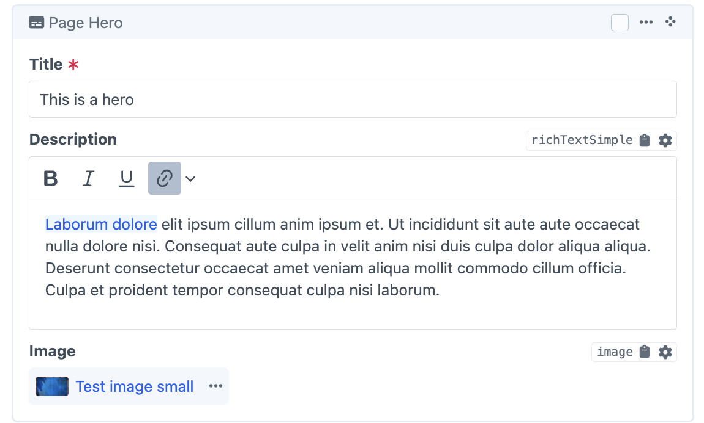 | 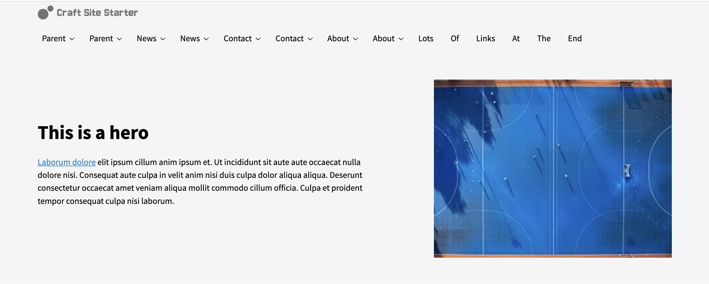 |

#### Call to Action

| Admin                                       | Frontend                                       |
| ------------------------------------------- | ---------------------------------------------- |
| 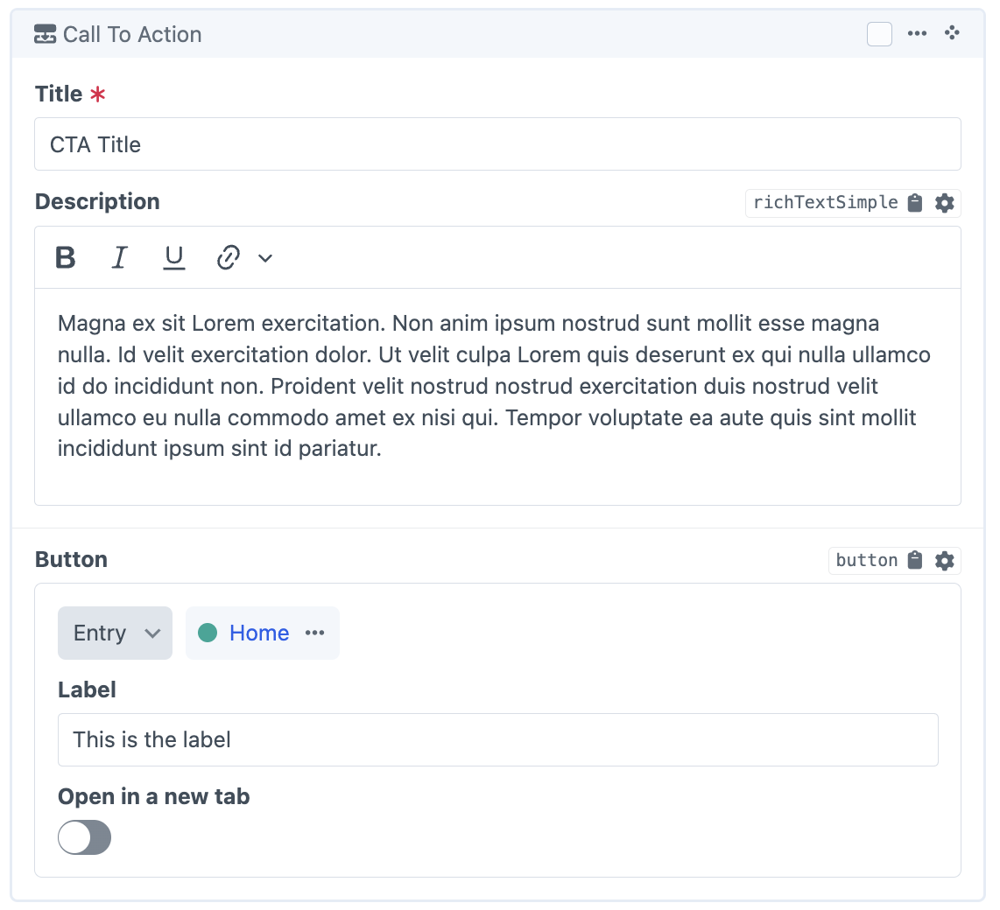 |  |

#### Card Grid

| Admin                                  | Frontend                                  |
| -------------------------------------- | ----------------------------------------- |
| 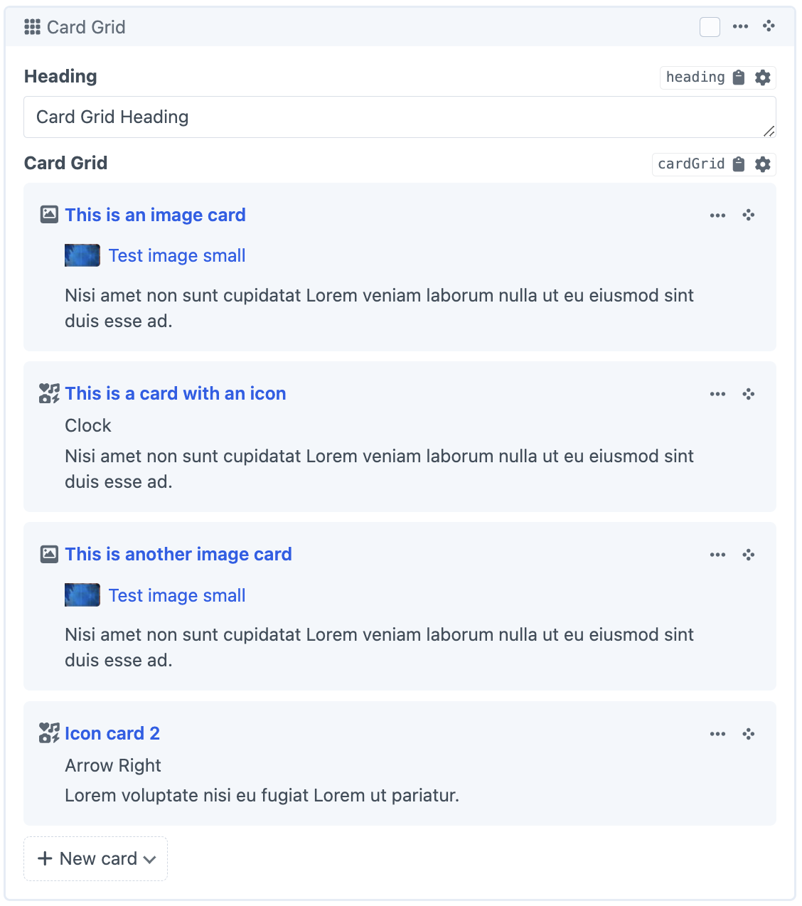 | 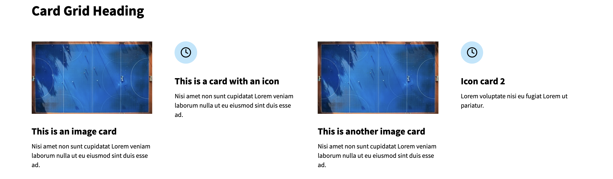 |

#### Heading

| Admin                                | Frontend                                |
| ------------------------------------ | --------------------------------------- |
| 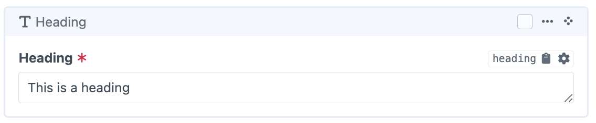 | 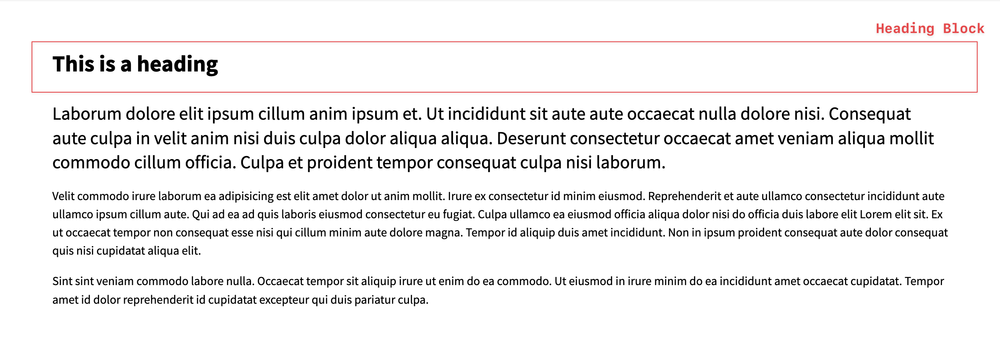 |

#### Rich Text

| Admin                                  | Frontend                                  |
| -------------------------------------- | ----------------------------------------- |
| 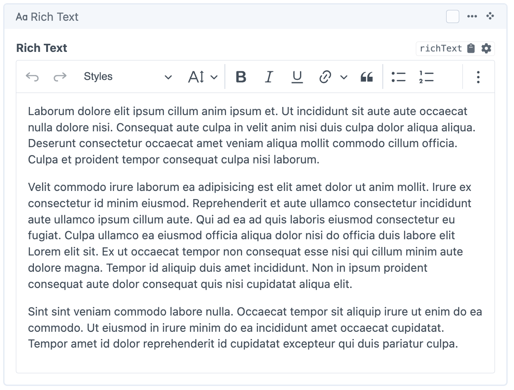 | 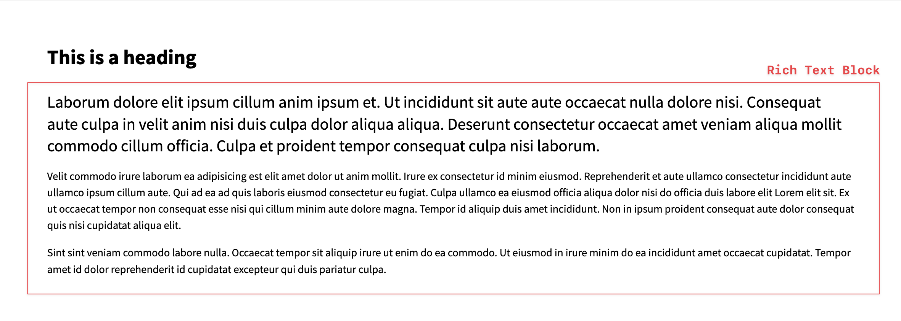 |

#### Text with Media (Image)

| Admin                                              | Frontend                                              |
| -------------------------------------------------- | ----------------------------------------------------- |
| 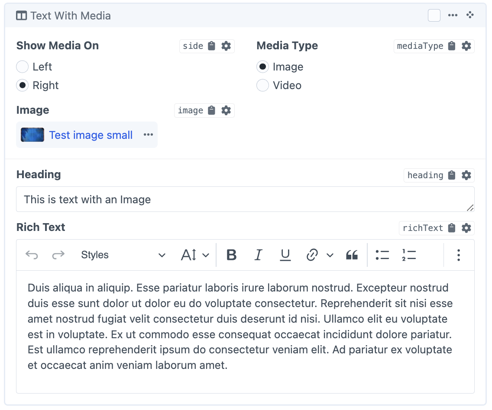 | 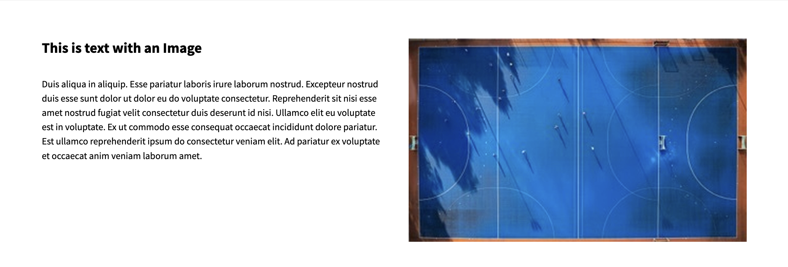 |

#### Text with Media (Video)

| Admin                                              | Frontend                                              |
| -------------------------------------------------- | ----------------------------------------------------- |
| 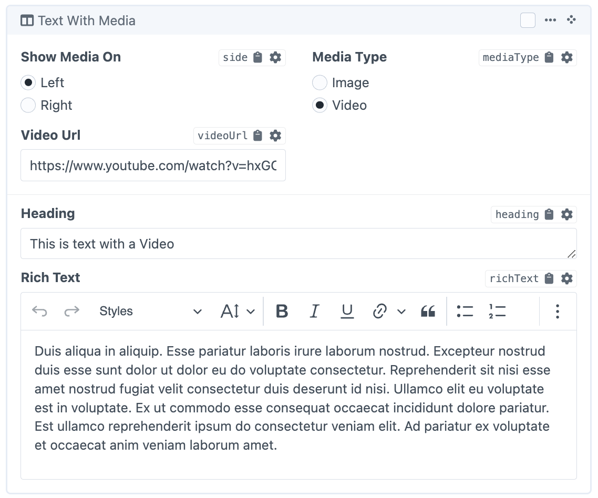 | 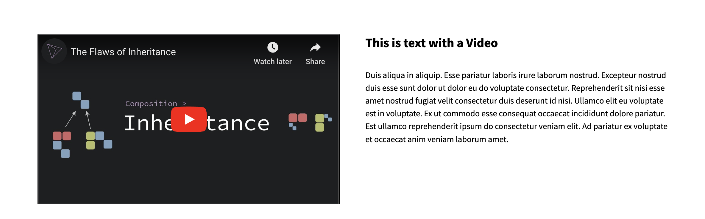 |

- Unlike WordPress, the entire site won't be built with a "Gutenberg" like editor.
- For some projects, budget can be reduced by planning for the majority of pages using the Matrix field block editor.
- However, a large project would likely take a hybrid approach and use the block editor for some sections and Craft's typical custom field setup for others.

## For Developers (Platform & UI)

- All components and Tailwind plugins are meant to be modified directly.
- There is a pre-configured parts kit for building and testing components in isolation.
- These components provide a solid starting point and consistent structure for creating new components.
- Craft comes with commonly used plugins pre-installed and configured.
- Build tooling such as Vite, Tailwind and Alpine.js are pre-configured.
- Code quality and formatting tools such as Prettier, PHPStan and PHPECS run on every commit.
